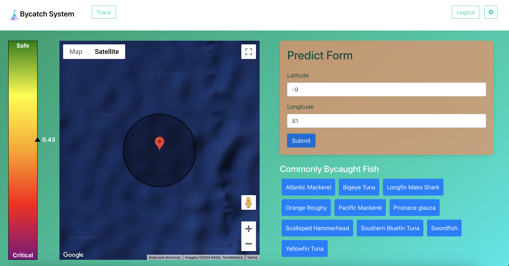

# Future of Data Hackathon Project

## Table of Contents
1. [Overview](#overview)
2. [Features](#features)
3. [Technologies Used](#technologies-used)
4. [Setup and Installation](#setup-and-installation)
5. [Usage](#usage)
   - [Bycatch Severity Prediction](#bycatch-severity-prediction)
   - [Sign Up](#sign-up)
   - [Login](#login)
   - [Settings](#settings)
6. [Deployment](#deployment)
7. [Contributing](#contributing)
8. [License](#license)
9. [Contact](#contact)
10. [Acknowledgements](#acknowledgements)

## Overview

This project is designed to track and predict bycatch severity using machine learning models. It includes functionalities for user login, sign-up, and settings management.

## Features

- User login, signup, and settings
- Settings management
- Ready-to-go database system
- Bycatch prediction form
- [Google Maps](https://developers.google.com/maps/) integration


## Technologies Used

- Python 3.10 (3.8+ needed)
- Flask
- SQLAlchemy
- TensorFlow
- Pandas
- Numpy 
- JavaScript (jQuery )
- HTML/CSS

## Setup and Installation

1. **Clone the repository:**

    ```sh
    git clone https://github.com/wyatt-combs-11/future-of-data-hackathon.git
    cd future-of-data-hackathon
    ```

2. **Create a virtual environment:**

    ```sh
    python3 -m venv venv
    source venv/bin/activate  # On Windows use `venv\Scripts\activate`
    ```

3. **Install the required packages:**

    ```sh
    pip install -r requirements.txt
    ```

4. **Set up environment variables:**

   Create a `.env` file in the root directory and add the following:

    ```env
    DATABASE_URL=sqlite:///accounts.db
    GOOGLE_MAPS_API_KEY=your_google_maps_api_key
    ```

   Replace `your_google_maps_api_key` with your actual Google Maps API key.

5. **Run the application:**

    ```sh
    python app.py
    ```

   The application will be available at `http://0.0.0.0:5000`.

## Usage

### Bycatch Severity Prediction

After logging in, you can use the bycatch severity prediction feature by entering the longitude and latitude of the location you want to predict.
The scale to the left will show the matching severity score and where a location stands on the severity spectrum. The map is interactive, allowing for zoom (in/out), dragging and clicking.
<br><br>

<br><br>
The corresponding fish buttons at the bottom right of the screen represent the ten fish used to train the model. Clicking each button will result in an informational
popup screen, giving information on properly dealing with and preventing bycatches of each species.

### Sign Up

To create a new account, navigate to the sign-up page and fill in the required details (username, password, and email). Once the form is submitted, your account will be created, and you will be logged in automatically.

### Login

To log in, navigate to the login page and enter your username and password. If the credentials are correct, you will be logged in and redirected to the home page.

### Settings

Once logged in, you can update your email and password from the settings page.

## Deployment

The application is set up to be deployed on Heroku with a PostgreSQL database. You can find the deployed Heroku app [here](https://google.com).

## Contributing

1. File an issue to notify the maintainers about what you're working on.
2. Fork the repo, develop and test your code changes, add docs.
3. Make sure that your commit messages clearly describe the changes.
4. Send a pull request.

## License

This project is licensed under the MIT License. See the [LICENSE](LICENSE.txt) file for details.

## Contact
For any questions or issues, please contact the maintainers:
- [GitHub Issues](https://github.com/wyatt-combs-11/future-of-data-hackathon/issues)
- [Email](mailto:combscodes@gmail.com)

## Acknowledgements
- Thanks to Anthony Frederico for the initial flask template (FlaskEx)


